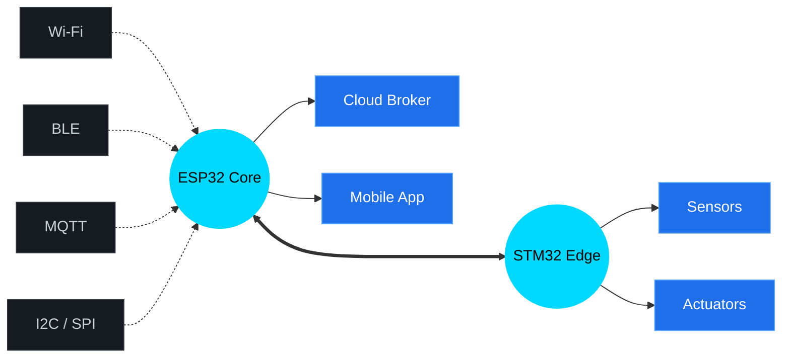

<!-- ╔══════════════════════════════════════════════════════════════════╗ -->
<!-- ║                    ✨ GITHUB PROFILE README ✨                    ║ -->
<!-- ╚══════════════════════════════════════════════════════════════════╝ -->

<!-- ░░░░░░░░░░░░░░░░░░░░░░░░ HEADER BANNER ░░░░░░░░░░░░░░░░░░░░░░░░ -->

<div align="center">
  


<a href="https://github.com/tnc4y">
  
</a>

<br/>


<br/><br/>

<a href="https://github.com/tnc4y">
  
</a>


</div>

<br/>

<!-- ░░░░░░░░░░░░░░░░░░░░░░░░ ABOUT ME ░░░░░░░░░░░░░░░░░░░░░░░░ -->


##  &nbsp; About Me

```yaml
name: "İsmin Buraya"
role: Mobile & IoT Developer
location: Konya, Türkiye 🇹🇷

current_focus:
  - 📱 Building cross-platform apps with Flutter
  - 📡 Designing IoT ecosystems with ESP32 & STM32
  - ☁️  Deploying scalable services on AWS & Cloudflare
  - 🐳 Containerizing everything with Docker

passions: [ "Clean Architecture", "Real-time Systems", "Edge Computing" ]
fun_fact: "Coffee in → Code out ☕"
```

<br clear="right"/>

<!-- ░░░░░░░░░░░░░░░░░░░░░░░░ TECH STACK GRAPH ░░░░░░░░░░░░░░░░░░░░░░░░ -->

##  &nbsp; Tech Universe — Connected Graph

> *Tüm uzmanlık alanlarımın merkezinde **mobil** ve **IoT** geliştirme var — etrafında onları besleyen tüm teknolojiler.*

```mermaid
graph TB
    CORE(("CORE STACK"))

    CORE === MOBILE["MOBILE"]
    CORE === IOT["IoT"]
    CORE === CLOUD["CLOUD"]
    CORE === DEVOPS["DEVOPS"]

    MOBILE --- M1["Flutter"]
    MOBILE --- M2["Dart"]
    MOBILE --- M3["Firebase"]
    MOBILE --- M4["Supabase"]
    MOBILE --- M5["FCM Push"]
    MOBILE --- M6["Riverpod / BLoC"]

    IOT --- I1["ESP32"]
    IOT --- I2["STM32"]
    IOT --- I3["MQTT"]
    IOT --- I4["BLE / Wi-Fi"]
    IOT --- I5["FreeRTOS"]
    IOT --- I6["C / C++"]

    CLOUD --- C1["AWS"]
    CLOUD --- C2["Cloudflare"]
    CLOUD --- C3["Workers / Lambda"]
    CLOUD --- C4["R2 / S3"]
    CLOUD --- C5["D1 / DynamoDB"]

    DEVOPS --- D1["Docker"]
    DEVOPS --- D2["Compose"]
    DEVOPS --- D3["GitHub Actions"]
    DEVOPS --- D4["Nginx"]
    DEVOPS --- D5["Linux"]

    classDef coreStyle fill:#00d9ff,stroke:#00d9ff,color:#000,stroke-width:3px
    classDef hubStyle fill:#1f6feb,stroke:#58a6ff,color:#fff,stroke-width:2px
    classDef leafStyle fill:#161b22,stroke:#30363d,color:#c9d1d9,stroke-width:1px

    class CORE coreStyle
    class MOBILE,IOT,CLOUD,DEVOPS hubStyle
    class M1,M2,M3,M4,M5,M6,I1,I2,I3,I4,I5,I6,C1,C2,C3,C4,C5,D1,D2,D3,D4,D5 leafStyle
```



<br/>

<!-- ░░░░░░░░░░░░░░░░░░░░░░░░ MOBILE SECTION ░░░░░░░░░░░░░░░░░░░░░░░░ -->

##  &nbsp; Mobile Development — The Core

<table>
<tr>
<td width="50%" valign="top">

### 📱 What I Build
- **Cross-platform** apps with a single codebase
- **Real-time** chat & notification systems
- **Offline-first** architectures with local DBs
- **Background services** for tracking & sync
- **Native** integrations (camera, BLE, NFC, sensors)
- **Animated** & high-performance UIs

### 🧩 Architecture
`Clean Architecture` · `MVVM` · `Repository Pattern` · `DI` · `TDD`

</td>
<td width="50%">

<div align="center">
  
**Flutter & Mobile Arsenal**


<br/><br/>


</div>

</td>
</tr>
</table>

<br/>

<!-- ░░░░░░░░░░░░░░░░░░░░░░░░ IoT SECTION ░░░░░░░░░░░░░░░░░░░░░░░░ -->

##  &nbsp; IoT World — ESP32 at the Center



<table>
<tr>
<td width="50%">

### 🔧 Microcontrollers
<p>


</p>

### 📡 Connectivity
<p>


</p>

</td>
<td width="50%">

### ⚙️ Frameworks & RTOS
<p>


</p>

### 💻 Languages
<p>


</p>

</td>
</tr>
</table>

<br/>

<!-- ░░░░░░░░░░░░░░░░░░░░░░░░ CLOUD SECTION ░░░░░░░░░░░░░░░░░░░░░░░░ -->

##  &nbsp; Cloud Services — AWS & Cloudflare

<table>
<tr>
<td width="50%" valign="top">

###  &nbsp; Amazon Web Services

<p>


</p>

```yaml
use_cases:
  - Serverless mobile backends (Lambda + API GW)
  - IoT telemetry pipelines (IoT Core + DynamoDB)
  - File storage & CDN (S3 + CloudFront)
  - Push notifications (SNS + FCM/APNS)
```

</td>
<td width="50%" valign="top">

###  &nbsp; Cloudflare

<p>


</p>

```yaml
use_cases:
  - Edge-deployed APIs (Workers + D1)
  - Global static hosting (Pages + R2)
  - Secure IoT device access (Tunnel + Access)
  - Real-time state at the edge (Durable Objects)
```

</td>
</tr>
</table>

<br/>

<!-- ░░░░░░░░░░░░░░░░░░░░░░░░ DOCKER & DEVOPS ░░░░░░░░░░░░░░░░░░░░░░░░ -->

##  &nbsp; DevOps & Containers

<div align="center">


<br/><br/>

<table>
<tr>
<td align="center" width="20%">
<br/>
<b>Docker</b><br/>
<sub>Containerization</sub>
</td>
<td align="center" width="20%">
<br/>
<b>Kubernetes</b><br/>
<sub>Orchestration</sub>
</td>
<td align="center" width="20%">
<br/>
<b>Nginx</b><br/>
<sub>Reverse Proxy</sub>
</td>
<td align="center" width="20%">
<br/>
<b>GH Actions</b><br/>
<sub>CI / CD</sub>
</td>
<td align="center" width="20%">
<br/>
<b>Linux</b><br/>
<sub>Server Admin</sub>
</td>
</tr>
</table>

</div>

```dockerfile
# How I ship everything
FROM mobile-backend:latest
RUN apt-get install -y confidence automation scalability
COPY ./brain /app/code
EXPOSE 80 443 1883
CMD ["docker-compose", "up", "--scale", "dreams=infinite"]
```

<br/>

<!-- ░░░░░░░░░░░░░░░░░░░░░░░░ FULL TECH MATRIX ░░░░░░░░░░░░░░░░░░░░░░░░ -->

##  &nbsp; Complete Skill Matrix

<div align="center">


</div>

<br/>

<!-- ░░░░░░░░░░░░░░░░░░░░░░░░ GITHUB STATS ░░░░░░░░░░░░░░░░░░░░░░░░ -->

##  &nbsp; GitHub Analytics

<div align="center">

<a href="https://github.com/tnc4y">
  
  
</a>

<br/>


<br/>


<br/>


</div>

<br/>

<!-- ░░░░░░░░░░░░░░░░░░░░░░░░ CONTACT ░░░░░░░░░░░░░░░░░░░░░░░░ -->

##  &nbsp; Let's Connect

<div align="center">

<a href="mailto:mail@example.com">
  
</a>
<a href="https://linkedin.com/in/tnc4y">
  
</a>
<a href="https://twitter.com/tnc4y">
  
</a>
<a href="https://t.me/tnc4y">
  
</a>
<a href="https://discord.com/users/tnc4y">
  
</a>

</div>

<br/>

<!-- ░░░░░░░░░░░░░░░░░░░░░░░░ QUOTE ░░░░░░░░░░░░░░░░░░░░░░░░ -->

<div align="center">

### ✨ Daily Dev Quote


</div>

<br/>

<!-- ░░░░░░░░░░░░░░░░░░░░░░░░ FOOTER ░░░░░░░░░░░░░░░░░░░░░░░░ -->


